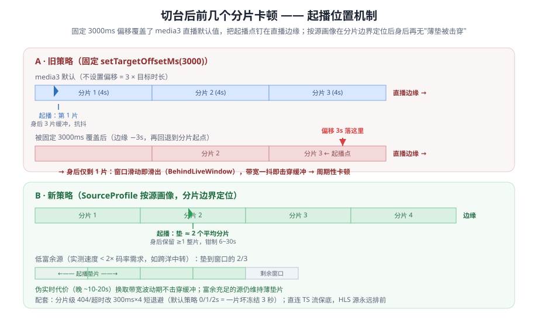
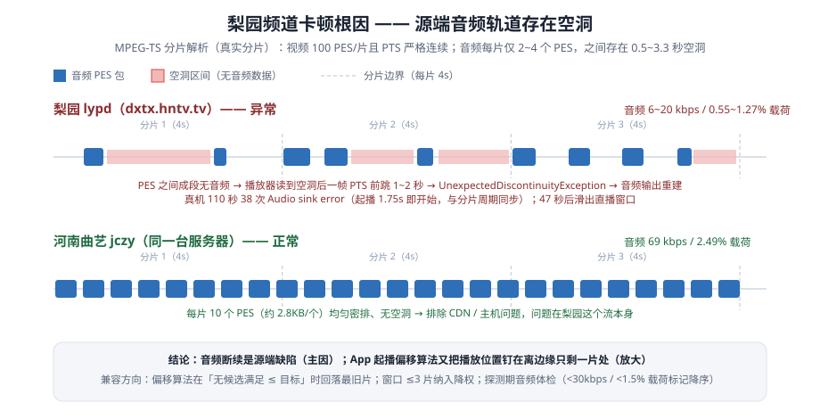
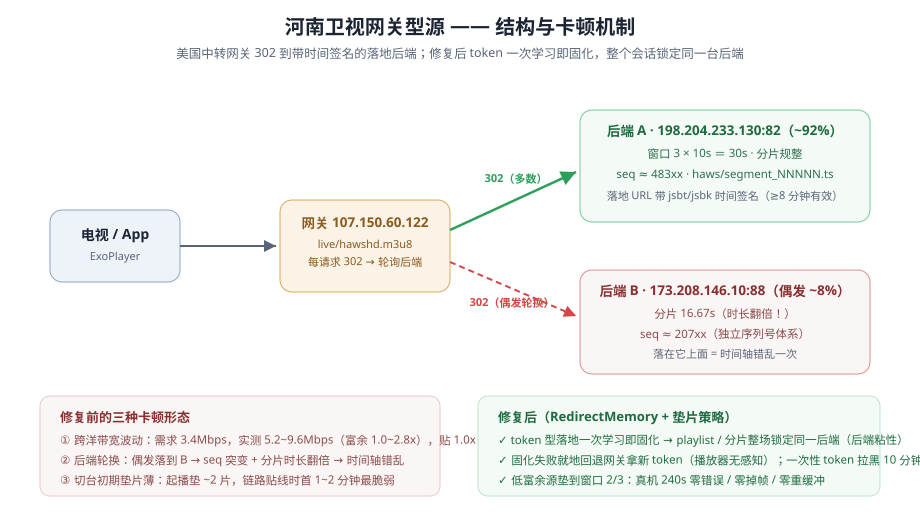
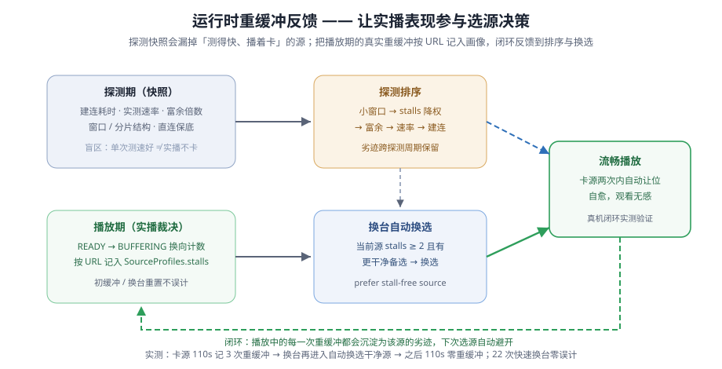
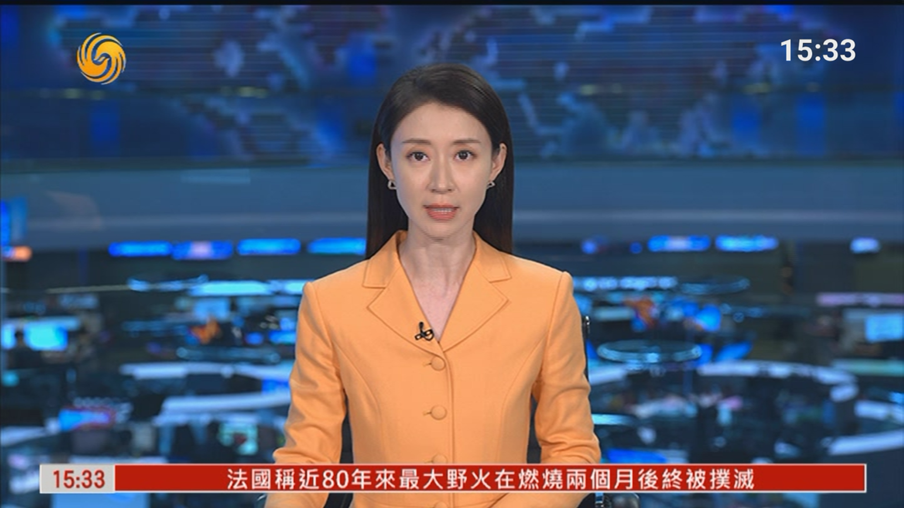
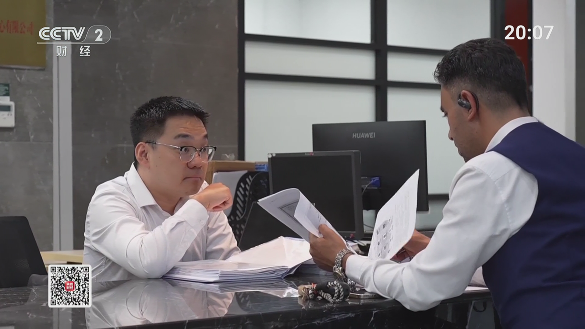
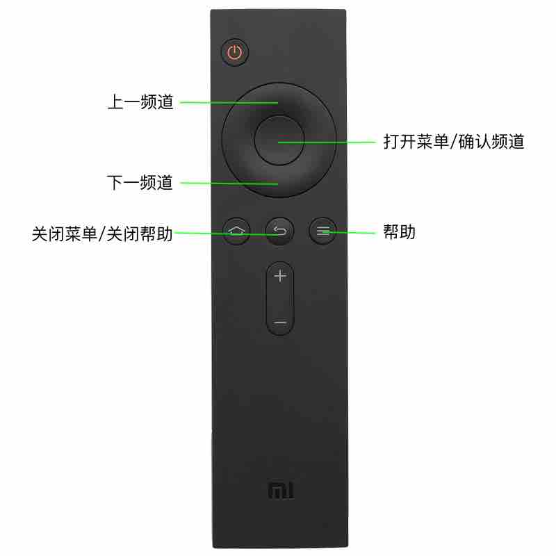

# 我的电视 · fshby 定制版

> 基于 [lizongying/my-tv](https://github.com/lizongying/my-tv) v2.1.8 界面基座深度定制。  
> 适配国内电视 / 电视盒子，支持远程 m3u8 频道列表、自动探测去重、多源容错与独立自升级。  
> 最新发布：**v2.4.2** ｜ [下载 APK / 在线升级](https://fshby.github.io/fshby.github.io.mytv/) ｜ 安装包名 `com.fshby.mytv`（可与官方版并存安装）

## 版本简介 · v2.4.2

> 本次仅更换应用图标：启用全新设计的 logo（保留原图完整构图），并修复 logo 文件为 JPEG 误名 `.png` 导致资源编译失败的问题。**功能与 v2.4.1 完全一致**。

### v2.4.1（上一版）

> 本次聚焦「开机自启动可靠性」：v2.4.0 发布当日在小米电视真机上完成的三个修复（自启动全链路加固 / 待机唤醒拉起修正 / 桌面直达引导），全部真机闭环验证。

| 方向 | 修改点与优化项 |
| --- | --- |
| **开机自启动加固** | 授权自检补上无障碍总开关校验（消除「条目在、总开关关」半写态被误判已就绪的盲区）；两条系统设置写入拆开独立校验，不再产生半写态；自启动开关默认开启（`pm clear` 后重新打开应用即自动恢复，显式关闭仍被尊重）；开机拉起窗口 5→10 分钟、节流 10s→3s、+3s/+15s 兜底重试；设置页新增四项状态自检与「修复开机自启授权」一键按钮。 |
| **待机唤醒拉起修复** | 旧版把所有拉起统一卡在开机后 10 分钟内，长待机后唤醒不再被拉起（真机 uptime 4727s 被拒实测）；改为「开机窗口 / 唤醒窗口」双判据 + 屏幕点亮/熄灭运行时接收器，点亮即拉、桌面窗口事件兜底，已回前台则去重；跳过路径打印判据快照，静默失败可 adb 定位。 |
| **桌面直达** | Manifest 声明 HOME/LEANBACK_HOME 使本应用成为可选桌面候选（不改变默认桌面），在走默认桌面解析的 ROM 上待机唤醒即回本应用；设置页新增「开机直达桌面」状态与引导；对把该设置指向空壳页面的 ROM（小米电视）自动探测并提示本机不可用，不再打断播放。 |

### v2.4.0（更早版本）

> 本次聚焦「播放兼容性深度调优」与「开机自启动」，全部基于真机（烽火 HG680-KF / 小米电视）取证与闭环验证。

| 方向 | 修改点与优化项 |
| --- | --- |
| **播放兼容性** | 切台起播偏移改按源画像动态计算（真实分片边界垫 ≈2 片、钳 6~30s）；分片级 404 / 502 / 超时改为 300ms×4 短退避（默认策略一片坏要冻结 3 秒）；网关型源 token 落地一次学习即固化 + 整场后端粘性，失败就地回退网关；低带宽富余源起播垫片加到窗口 2/3（伪实时换流畅）；运行时重缓冲按 URL 记入源画像，排序惩罚 + 换台自动换选干净源；多源按实测吞吐富余排序、小窗口降权。 |
| **开机自启动** | MIUI TV 等不投递 `BOOT_COMPLETED` 的系统改走**无障碍服务通道**，开机约 8 秒自动进入应用；被强杀（切信号源 / 后台清理）导致授权被撤销时，应用下次启动自动检测补写（需一次性 `adb shell pm grant com.fshby.mytv android.permission.WRITE_SECURE_SETTINGS`）；修复自启动拉起时的启动崩溃（LiveData 分发链内 `commitNow` 重入 FragmentManager）。 |
| **稳定性与其它** | 内置频道列表快照兜底（无本地文件且无缓存时使用内置列表）；系统时钟异常（证书未生效 / 偏差 >24h）检测与 Toast 提示；完整播放异常分析报告与 4 张机制图入库（`docs/`）。 |

### v2.3.0（更早版本）

| 方向 | 修改点与优化项 |
| --- | --- |
| **频道质量** | 死源探测增加内容校验（媒体 Content-Type / `#EXTM3U` / TS 同步字节 0x47），剔除「返回 200 空页面」的伪活源；探测读响应体限量 2KB，修复无 `Range` 支持的直播流导致的 OOM 崩溃循环；缓存直接保存过滤后的频道列表，启动秒开即为干净列表。 |
| **播放流畅度** | 同名多源合并（同一频道的多条线路不再只保留第一条）；探测记录建连 + 首字节耗时，保留最快 2 条线路并按耗时升序，默认播放最快线路；主源失败自动轮换频道内备用线路（轮换有上限，全线路失败才提示错误）；DNS 缓存（TTL 5 分钟 / 上限 256 条）+ 302 落地地址自适应固化；缓冲参数按短窗口 IPTV 源收紧（起播 2 秒 / 重缓冲 1.5 秒 / 关闭后台缓冲）；切后台由 `stop()` 改为 `pause()` 保活。 |
| **启动速度** | 启动闸门与网络请求解耦（断网也能进入界面）；频道列表预加载 + 缓存条件请求（ETag / Last-Modified + 内容签名），列表未变化时整段跳过重新探测；探测延后 20 秒启动、并发 12→6；M3U 解析热路径重写。 |
| **界面** | 远程频道图标优先复用内置官方台标，按 CCTV 编号建键匹配（CCTV-4K / 8K 与 CCTV-4 正确区分）。 |
| **稳定性** | 加固列表重建期适配器空值强转、空源频道下标越界、视图销毁后延迟回调等 6 处闪退点；多源轮换加上限，避免坏源无限轮换。 |

完整历史见 [HISTORY.md](./HISTORY.md)。

## 播放异常分析与兼容方案 · 深度调优记

针对真机上的四类播放异常做了完整的根因定位（MPEG-TS 分片级取证、流式 logcat、源出口实测）与兼容落地（**v2.4.0 已发布**），完整复盘见 **[docs/playback-analysis.md](./docs/playback-analysis.md)**：

| 异常现象 | 根因 | 兼容方案 |
| --- | --- | --- |
| 切台后前几个分片卡顿 | 固定 3s 起播偏移把播放点钉在直播边缘，身后仅 1 片缓冲 | 按源画像在**真实分片边界**计算起播偏移（垫 ≈2 片、钳 6~30s）+ 分片级错误 300ms 短退避 + 探测升级（窗口/速率/建连三段式）+ 直连 TS 保底 |
| 梨园频道声音/画面反复中断 | **源端音频轨道空洞**（每 4s 仅 2~4 个音频 PES、码率 6~20kbps；同主机对照频道 69kbps 均匀） | 短窗口源降权 + 偏移算法边界修正；源端缺陷客户端只能规避（探测期音频体检规划中） |
| 河南卫视偶发卡顿（VLC 不卡） | 美国中转网关源：跨洋带宽富余仅 1.0~2.8x 波动 + 302 偶发轮换到序列号/分片时长完全不同的后端 | token 型落地**一次学习即固化**（整场锁定同一后端）+ 失败就地回退网关拿新 token + 低富余源垫片加到窗口 2/3（伪实时换流畅） |
| 「测得快、播着卡」的源被优先选中 | 探测快照无法感知实播表现 | 运行时 READY→BUFFERING 重缓冲按 URL 记入画像，**排序惩罚 + 换台自动换选**干净源（跨探测周期保留劣迹） |

**切台起播位置机制（问题 1）**——旧策略钉在直播边缘 vs 新策略按分片边界定位：



**梨园音频包分布（问题 2）**——分片级解析：梨园音频成段空洞，同主机对照频道均匀密排：



**网关型源结构（问题 3）**——302 轮询后端与修复后的粘性：



**运行时重缓冲反馈闭环（问题 4）**——实播表现参与选源决策：



真机验证结论：网关源 240s 播放 **0 错误 / 0 掉帧 / 0 重缓冲**；CCTV1 / CCTV13 及约 20 个央视频道走台零重缓冲；卡源两次内自动换选干净源，换选后 110s 零重缓冲；22 次快速换台零误计。

## 下载与安装

1. 访问 [fshby.github.io/fshby.github.io.mytv](https://fshby.github.io/fshby.github.io.mytv/) 下载最新 APK。
2. 拷贝到 U 盘，插入电视 / 盒子安装；或开启 ADB 后用命令安装：
   ```shell
   adb install my-tv-2.4.2.apk
   ```
3. 首次启动会自动拉取在线频道列表，稍等 3–8 秒即可观看。
4. 进入 **设置页 → 检查更新**，应用会读取 [update/version.json](https://fshby.github.io/fshby.github.io.mytv/update/version.json)，检测到新版后可直接下载并覆盖安装。

## 界面截图





## 遥控说明



| 按键 | 功能 |
| --- | --- |
| 上 / 下 | 上一个 / 下一个频道 |
| 左 / 右 | 打开 / 关闭频道列表 与 设置 |
| OK（中间圆键） | 确认选中 |
| 返回 | 关闭菜单 / 关闭帮助 |
| 菜单键（≡） | 打开帮助 |
| 音量 +/- | 调节音量 |
| 数字键 | 快速跳转到对应频道号 |

## 自定义频道源

- 自定义列表可放到盒子的 `/sdcard/Android/data/com.fshby.mytv/files/` 目录，支持：
  - `tvlist.m3u` / `tvlist.json` — 本地静态列表
  - `tvlist.remote` — 一行 URL，覆盖默认远程源
- 运行缓存：`cache/tvlist.cache`（探测过滤后的 M3U，用于秒开）与 `cache/tvlist.cache.meta`（缓存元信息）。

## 赞赏支持

如果觉得这个定制版对你有帮助，可以请我喝杯咖啡：

| 微信赞赏码 | 支付宝 |
| --- | --- |
|  |  |

## 已知待办

* 音量不同
* 大湾区卫视、广东4k超高清、广东珠江、三沙卫视、翡翠
* CHC高清三个电影频道
* 地方频道
* 收藏夹
* 海外
* 隐藏频道
* 亮度调节
* 音量调节
* 軟解

## 版权说明

本项目仅供学习研究，禁止用于商业用途，请于下载二十四小时内删除。

本项目可能随时终止，请大家谨慎使用，建议使用官方渠道进行观看。

本项目使用的部分代码、图片、文字等资源来源于网络，如有侵权，请联系删除。
